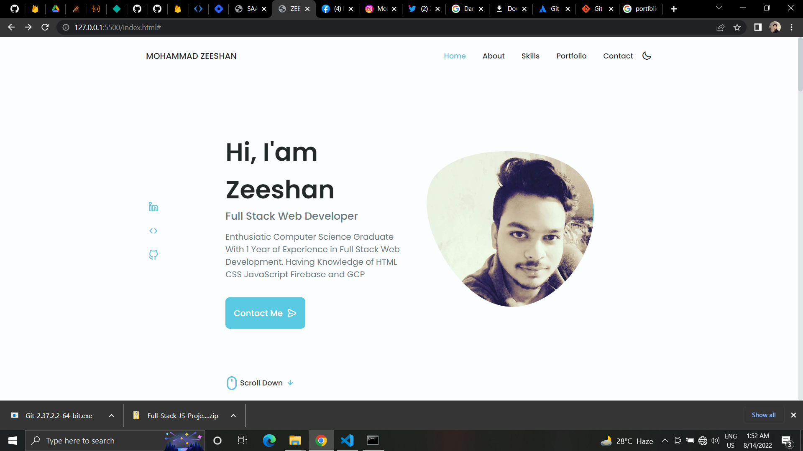
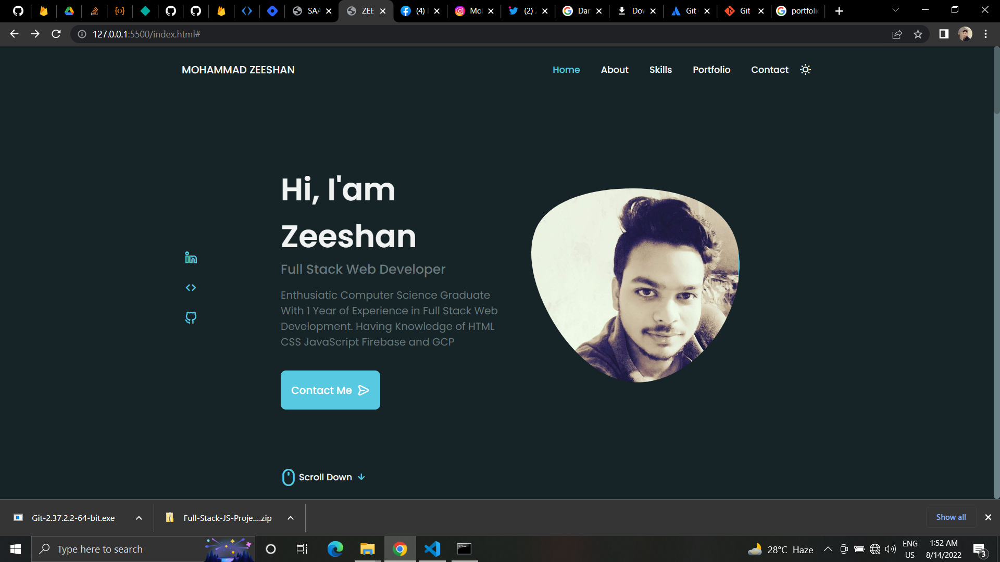

# Responsive Portfolio Website 

### Mohammad Zeeshan

## Portfolio Website [Live Link](https://zeeshan-portfolio09.netlify.app)

Responsive Portfolio Website Using HTML, CSS and JavaScript, with a beautiful user interface. 
Website contains: 
- Header 
- Home
- About
- Skills
- Qualification
- Portfolio
- Contact
- Footer 

If u liked my website and the code was useful to you,  
feel free to leave a star (much appreciated) fork it and customize as you like! :)

- Inspired design by Bedimcode-Alexa design 🙌
  

### preview

